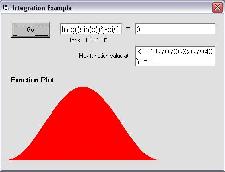



## Ulli's Math Module

### Description

This is a String Parser / Math Formula Evaluator OCX-Control. It contains over 100 functions: simple add / subtract, mult and div, roots, exponentiation and logarithm, math, trig and stat functions, conversions, LCD, SCM, primes, faculty, dates and times, differentiation and integratation and l.b.n.l. some functions for fuzzy sets and for plotting curves. All functions can be combined into huge formulae like for examüle Sin(33°+12'+21")*pi-e+3.3e4+sqr(5*(21-9)) which incidentally returns 33006.748173093. The Control also supports formulae with letters or names instead of numbers like r²*pi Whenever the Control detects a token in a formula, it will query the value for the token and the client may supply anything that is a valid formula including further tokens, thus enabling chain-calculations. A user accessible result stack is also implemented. Anyway - it's a treasure chest for math routines (for example containes a very fast prime number generator which can compute 100,000 primes in less than 2 (two!!!) seconds on an AMD Athlon(TM) XP1800+). A cross-linked help file is included as well as two sample proggies to test and demonstrate the capabilities. Download is 36 kB.
 
### More Info
 

             |
---                |---
**Submitted On**   |2002-04-06 11:46:16
**By**             |[ULLI](https://github.com/Planet-Source-Code/PSCIndex/blob/master/ByAuthor/ulli.md)
**Level**          |Advanced
**User Rating**    |5.0 (85 globes from 17 users)
**Compatibility**  |VB 6\.0
**Category**       |[Math/ Dates](https://github.com/Planet-Source-Code/PSCIndex/blob/master/ByCategory/math-dates__1-37.md)
**World**          |[Visual Basic](https://github.com/Planet-Source-Code/PSCIndex/blob/master/ByWorld/visual-basic.md)
**Archive File**   |[Ulli's\_Mat69313462002\.zip](https://github.com/Planet-Source-Code/ulli-ulli-s-math-module__1-33505/archive/master.zip)

